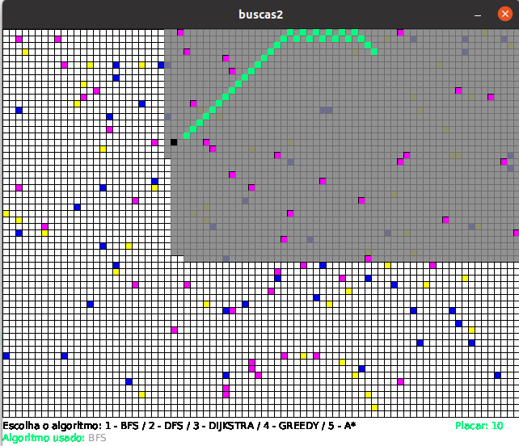

# Sistemas Inteligentes
Repositório para o projeto de Sistemas Inteligentes, que é um app contendo a implementação gráfica de 5 algoritmos de busca: BFS, DFS, Dijkstra, Greedy Search e A-Star. 

## Funcionamento:

Para executar o app, você precisa abrir o _sketchbook_ buscas2.pyde no processing, e ele carregará as classes necessárias (food.py, vehicle.py, queue.py). Após isso, basta executar o app e escolher seu método de busca:

1 - BFS

2 - DFS

3 - Dijkstra (Custo Uniforme)

4 - Greedy

5 - A-Star

A busca é a partir de um ponto onde está um quadrado verde até um ponto preto. Os pontos em rosa são os obstáculos, os em azul correspondem ao terreno custoso de água (custo 10) e os em amarelo correspondem ao terreno custoso de areia (custo 5). A busca ocorre na área cinza, que pode passar pelos terrenos custosos areia ou água, mas não passa pelo obstáculo. Quando o ponto verde se desloca até o alvo, é pintado um rastro verde por onde ele passa para que se possa observar o caminho escolhido.
